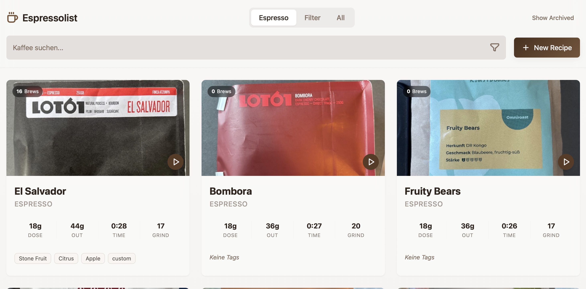
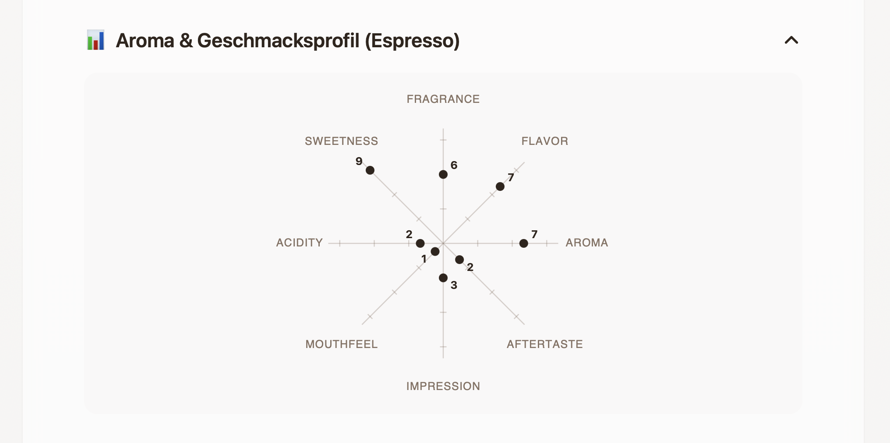
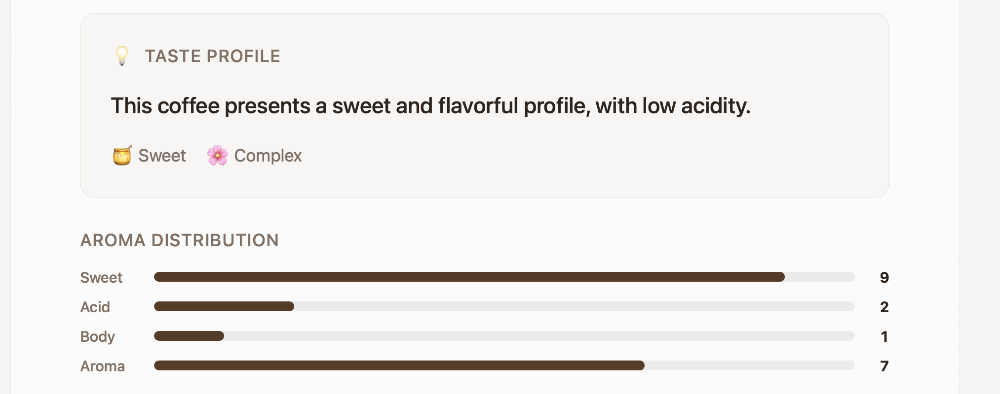
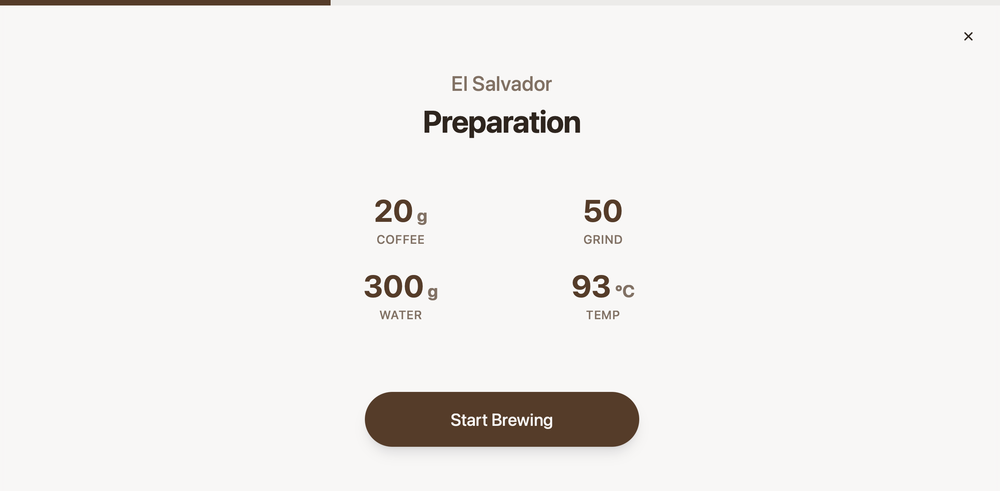
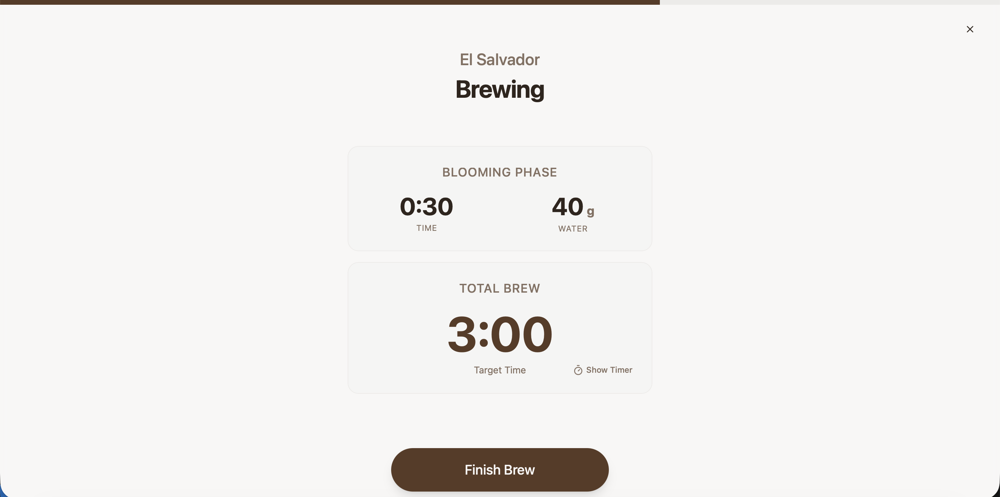

# Brew Notes Cafe ☕

**Brew Notes Cafe** is a modern, elegant application for tracking your coffee brewing recipes. Whether you're dialing in a new espresso bean or perfecting your V60 pour-over, this app helps you log every detail to achieve the perfect cup.

## ✨ Features

### ☕ Dual Brewing Modes
- **Espresso Mode**: Track precise inputs, outputs, and extraction times.
- **Filter Mode**: Dedicated interface for Pour-Over/Filter brewing with support for:
  - Blooming Phase tracking (Time & Water weight)
  - Total Brew Time monitoring
  - Customizable preparation metrics (Coffee, Grind Size, Water Temp)

### 📊 Advanced Analysis
- **Aroma Radar**: Visualize your coffee's flavor profile (Fragrance, Aroma, Acidity, Sweetness, Body, etc.) with an interactive radar chart.
- **Taste Tags**: Quickly tag brews with flavor notes (e.g., "Berry", "Chocolate", "Nutty").
- **Rating System**: 10-point scales for overall taste and flavor complexity.

### ⏱️ Smart Brewing Assistant
- **Interactive Timer**: Precision timer with haptic feedback.
- **Split Views**: Visual guidance for blooming and total brewing phases.
- **Wake Lock**: Keeps your screen awake during brewing sessions so you never lose track.
- **Auto-Calculations**: Automatically suggests blooming water weight (2x coffee weight).

### 📱 Modern UI/UX
- **Recipe Cards**: Beautiful card layouts displaying key metrics and flavor profiles at a glance.
- **Mobile First**: Optimized touch controls, including custom number pads and time inputs.
- **Dark Mode**: Sleek interface designed for any lighting condition.

## 📸 Screenshots

<div align="center">
  
</div>

<div align="center">
  
  
  
  
</div>

<br />

## 🛠 Tech Stack

- **Frontend**: React, Vite, Tailwind CSS, shadcn/ui, Framer Motion, Recharts
- **Backend**: Python (FastAPI), SQLite
- **Containerization**: Docker, Docker Compose, Nginx

## 🚀 Installation

The easiest way to run this project is using Docker. This works on any system with Docker installed, including Raspberry Pi.

### Prerequisites
- [Docker](https://docs.docker.com/get-docker/) installed on your system.

### Quick Start (Recommended)

1. **Clone the repository:**
   ```bash
   git clone https://github.com/yourusername/brew-notes-cafe.git
   cd brew-notes-cafe
   ```

2. **Run the setup script:**
   ```bash
   ./setup.sh
   ```

3. **Open your browser:**
   Go to [http://localhost:8080](http://localhost:8080)

### Manual Docker Start

If you prefer running commands manually:

```bash
docker-compose up -d --build
```

### Development Setup

If you want to contribute or run without Docker:

1. **Backend**:
   ```bash
   cd python-backend
   pip install -r requirements.txt
   uvicorn main:app --reload
   ```

2. **Frontend**:
   ```bash
   npm install
   npm run dev
   ```

## 📄 License

This project is licensed under the MIT License. Feel free to use, modify, and distribute it.  
